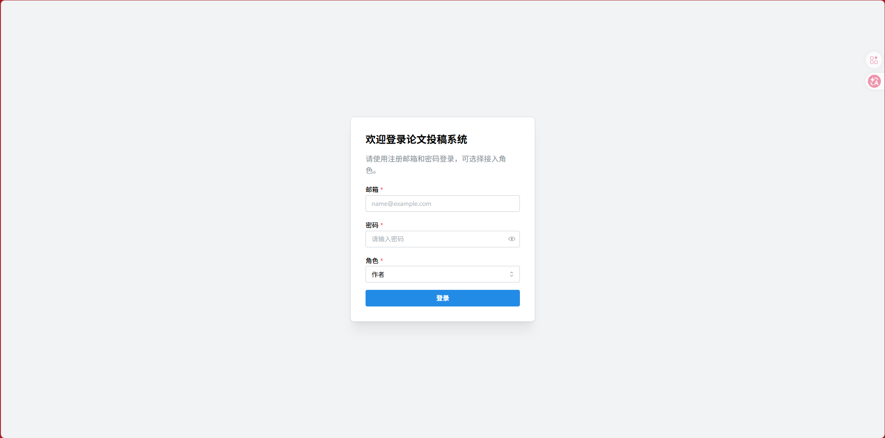
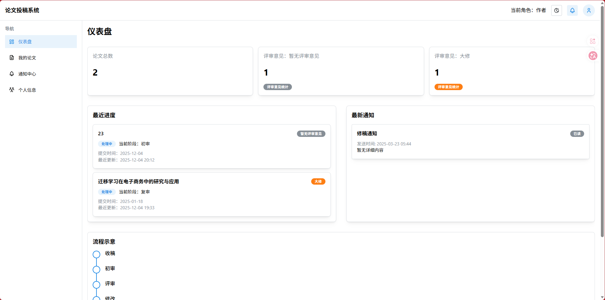
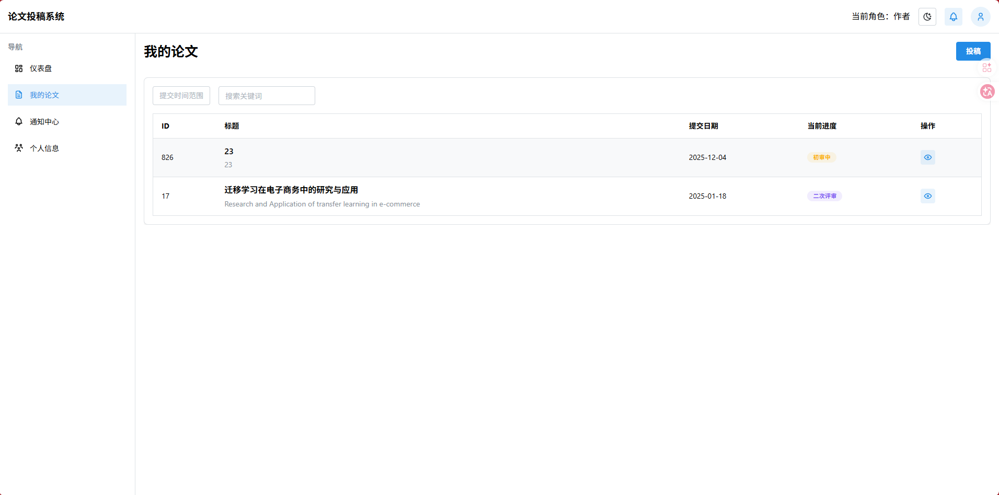
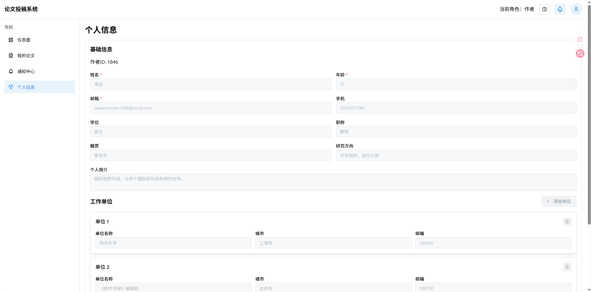
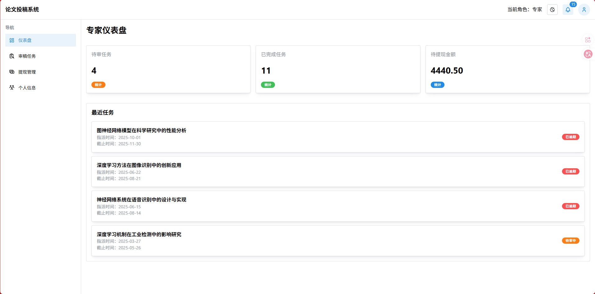
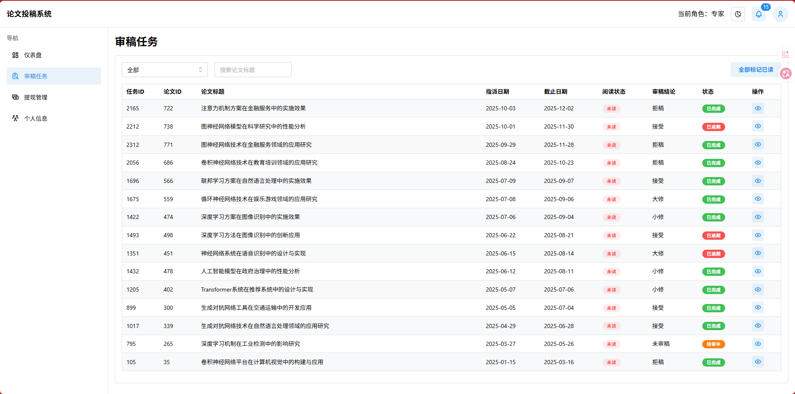
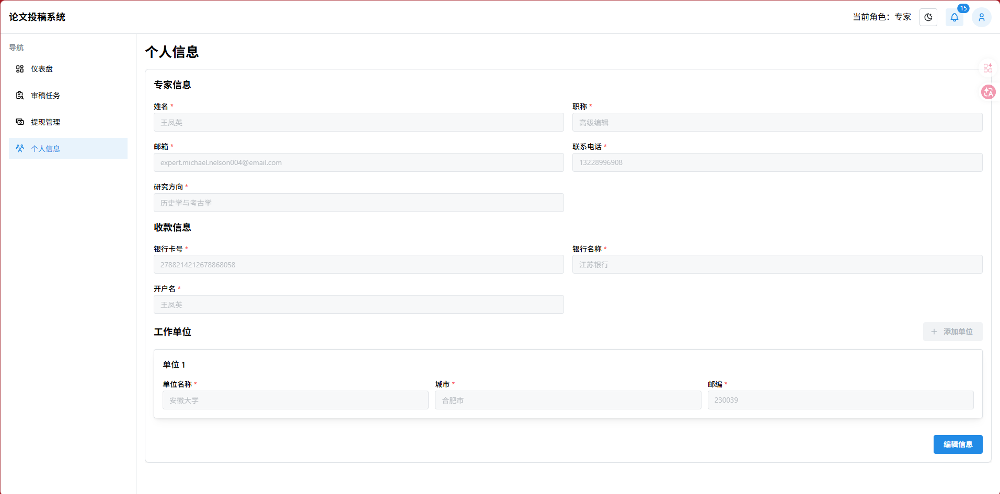
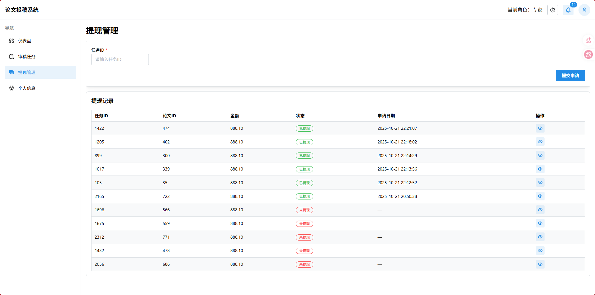
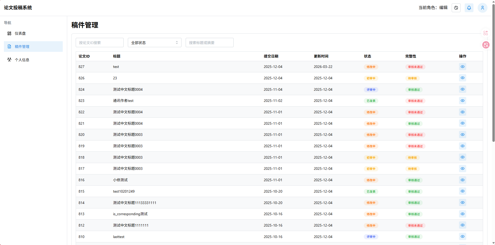
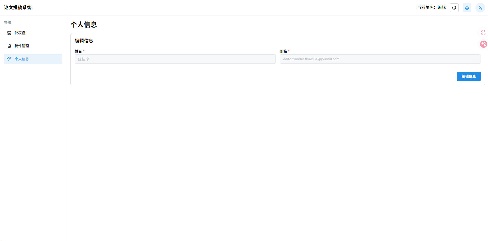

# Paper Submission System
[中文](README_CN.md)

A full-stack paper submission and management system consisting of a React frontend and a Node.js/Express backend.

## Project Structure

The project is divided into two main parts:

- `client/`: Frontend application built with React + Vite + Mantine
- `server/`: Backend application built with Node.js + Express + MySQL

## Features

- User Authentication (JWT)
- Paper Submission & Management
- Review System
- Role-based Access Control (Authors, Reviewers, Administrators)
- File Upload Support
- Docker Support

## Tech Stack

### Client
- React
- Vite
- Mantine UI
- React Query
- React Router
- Axios
- i18next (Internationalization)

### Server
- Node.js
- Express
- MySQL
- JWT Authentication
- Multer (File Uploads)

## Getting Started

### Prerequisites
- Node.js (v16+)
- MySQL
- Docker & Docker Compose (Optional)

### Running with Docker Compose (Recommended)

> **Note**: This project uses Git submodules for the frontend code. When cloning for the first time, add the `--recurse-submodules` flag to automatically pull submodules.

1. Clone the repository (with submodules):
```bash
git clone --recurse-submodules https://github.com/ZajacMo/paper-submission-system.git
cd paper-submission-system
```

2. Make sure Docker and Docker Compose are installed

3. Start the services:
```bash
docker-compose up --build
```

The services will be available at:
- Frontend: http://localhost:21743
- Backend API: http://localhost:5000

### Manual Setup

> **Note**: For manual installation, submodules need to be cloned separately:
> ```bash
> git clone --recurse-submodules https://github.com/ZajacMo/paper-submission-system.git
> ```
> Or after cloning, run:
> ```bash
> git submodule init
> git submodule update
> ```

#### Server

1. Navigate to the server directory:
```bash
cd server
```

2. Install dependencies:
```bash
npm install
```

3. Configure environment variables:
Create a `.env` file based on the configuration in `compose.yaml` or your local setup.

4. Initialize Database:
Execute the SQL scripts located in `server/SQL/` to set up your MySQL database.

5. Start the server:
```bash
npm start
```

#### Client

1. Navigate to the client directory:
```bash
cd client
```

2. Install dependencies:
```bash
npm install
```

3. Start the development server:
```bash
npm run dev
```

## Project Screenshots

### Login Page


### Author Interface
| | |
|---|---|
|  |  |
|  | |

### Expert/Reviewer Interface
| | |
|---|---|
|  |  |
|  |  |

### Editor Interface
| | |
|---|---|
|  |  |

## License

Copyright 2025 Zajac Mo

Licensed under the Apache License, Version 2.0 (the "License");
you may not use this file except in compliance with the License.
You may obtain a copy of the License at

    http://www.apache.org/licenses/LICENSE-2.0

Unless required by applicable law or agreed to in writing, software
distributed under the License is distributed on an "AS IS" BASIS,
WITHOUT WARRANTIES OR CONDITIONS OF ANY KIND, either express or implied.
See the License for the specific language governing permissions and
limitations under the License.
